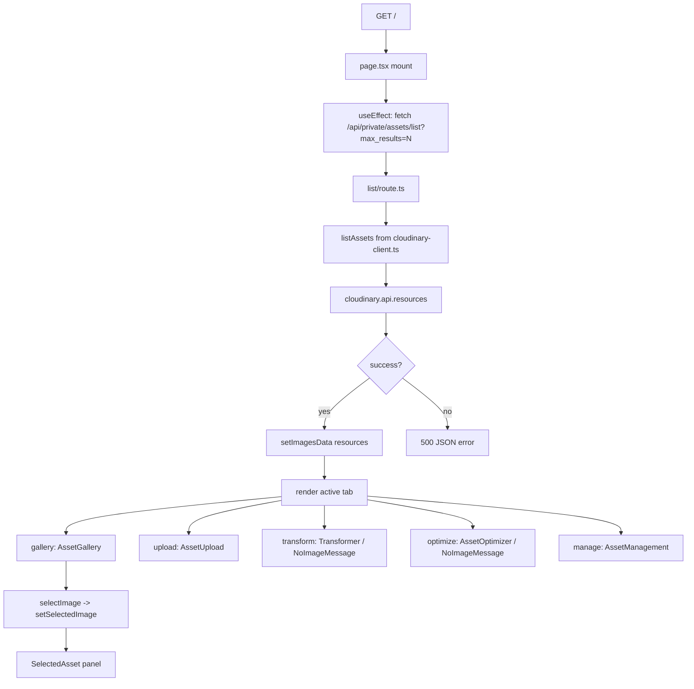
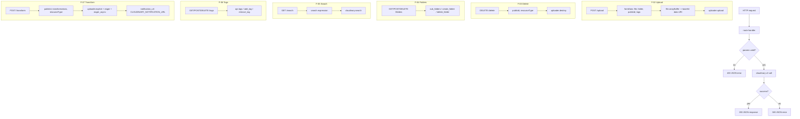
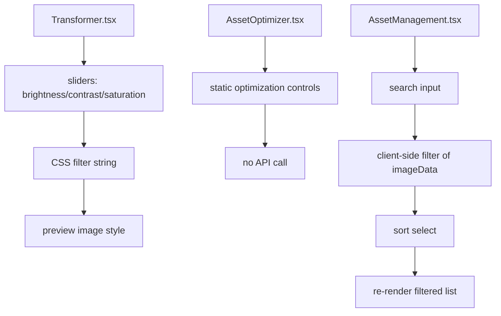
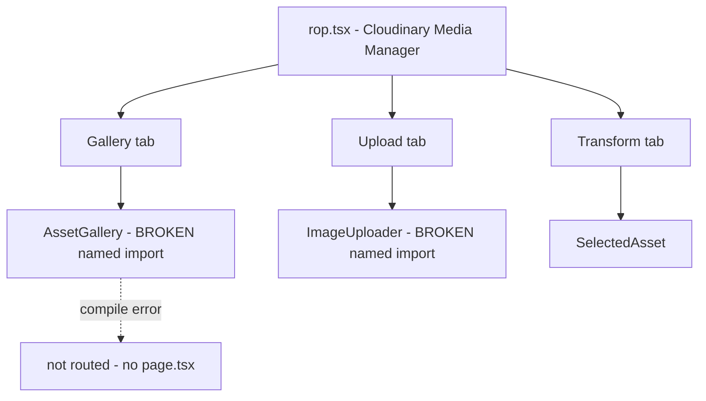
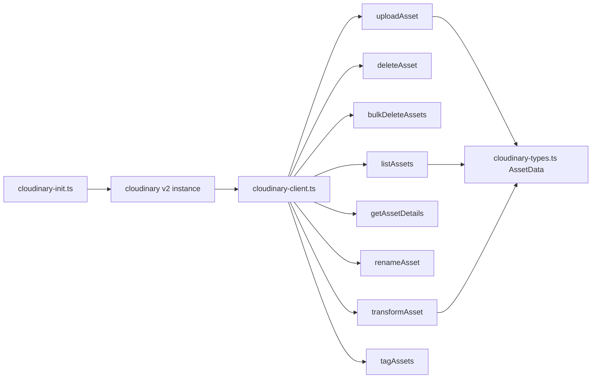

# Logic Flow Diagrams — cloudinary-next

**LFI Version:** 1.0
**Date:** 2026-09-21
**Status:** VERIFIED

Stable node IDs referenced from `LOGIC_FLOW_INDEX.md`. Node IDs are stable and traceable to source files.

---

## D-01 — Home Page Load & Asset Listing (F-01)

---

## D-02 — API Route Pattern (F-02 … F-07)

---

## D-03 — Client-Side UI Flows (F-08, F-09, F-10)

---

## D-04 — Alternate Page (F-11, UNROUTED)

---

## D-05 — Shared Library Layer

